## 基础使用说明

### 查看SSH信息

> 登录官网，点击 `Dashboard`，选择 `您已激活的产品/服务` 进入 `产品详情` ，在左侧 `Virtualizor` 菜单下，点击进入 `NAT Panel`，在新打开的页面中，即可看到SSH信息

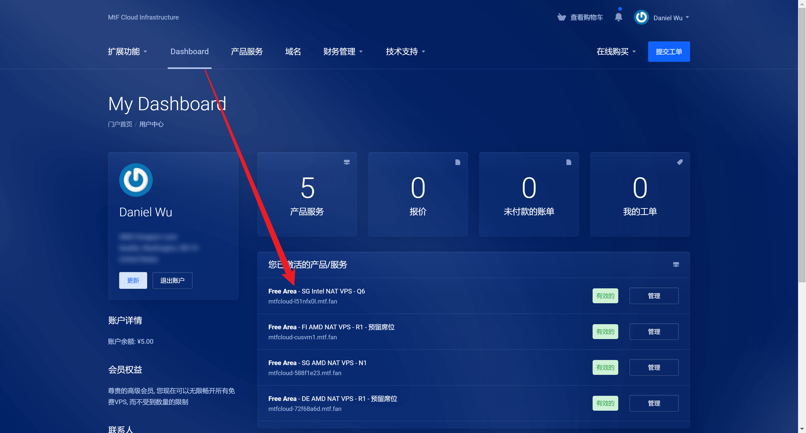
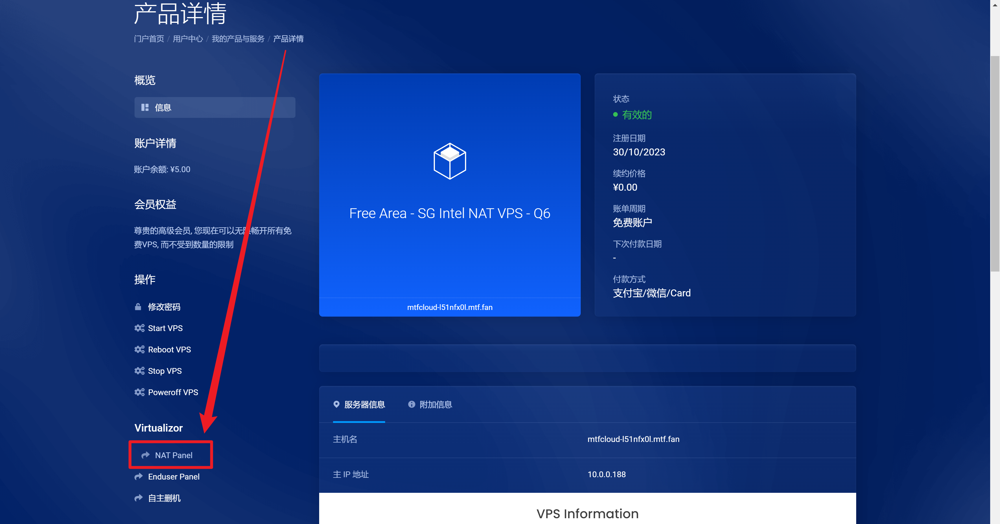
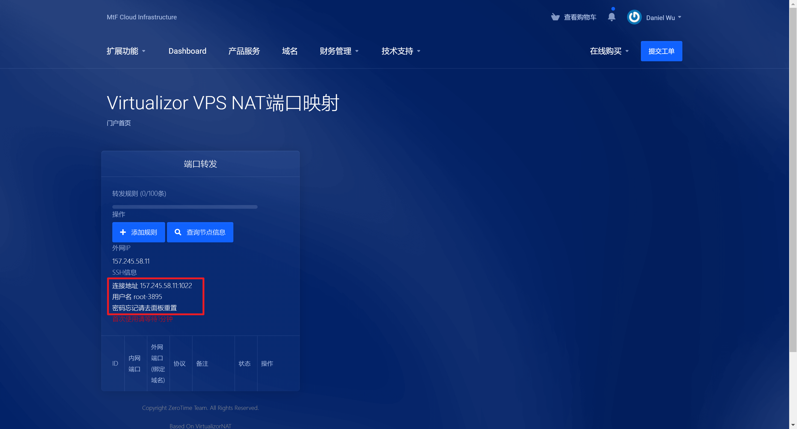

### 修改SSH密码

> 登录官网，点击`Dashboard`，选择`您已激活的产品/服务`

* 方案1: 点击产品详情页面左侧`修改密码`，按照页面提示填入新密码，保存修改后，页面提示`修改密码成功`，即可[重启](#重启)VPS
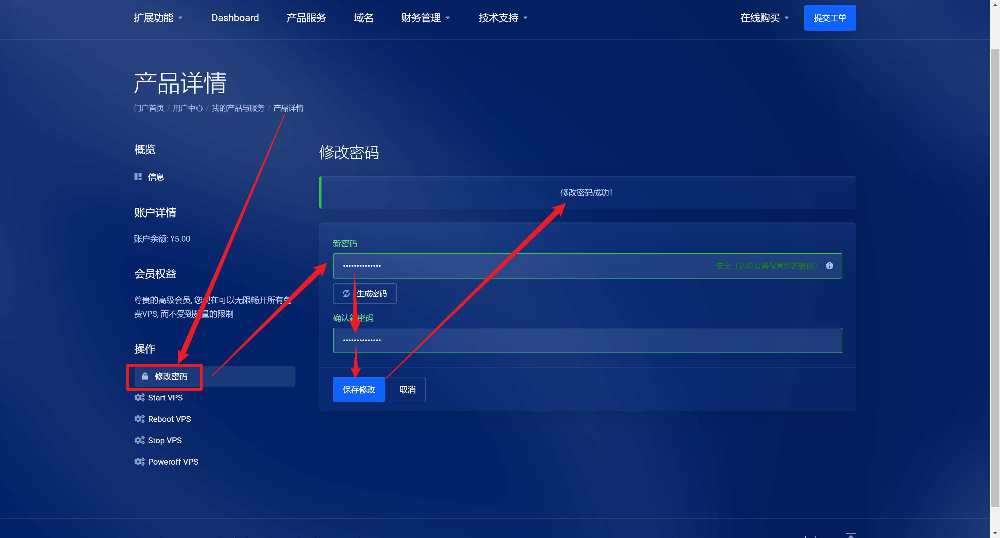

* 方案2: 点击产品详情页面左侧`Enduser Panel`，在`List VPS`页面选择你要操作的VPS，进入后台管理，按照页面提示填入新密码，提交修改后，页面弹框`Success`，即可[重启](#重启)VPS
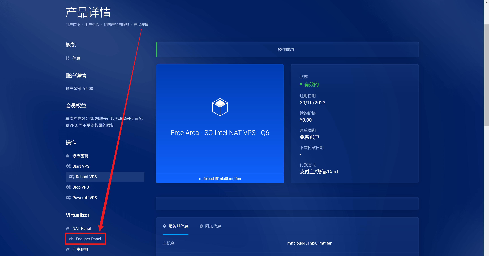
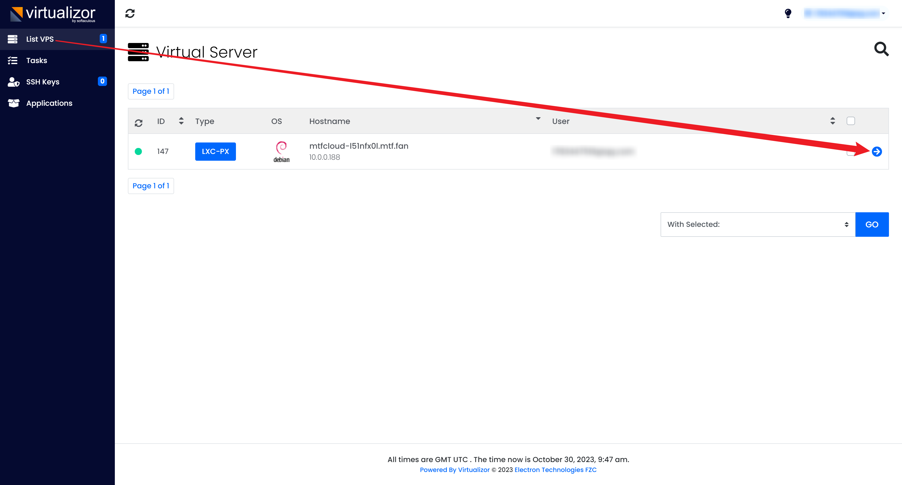
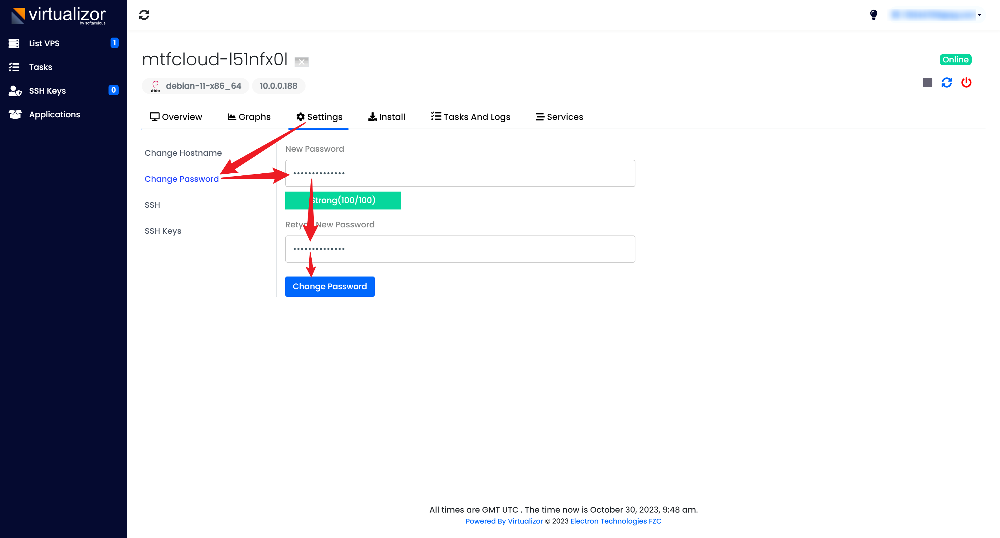

* 方案3: 在产品详情的`服务器信息`下的`VPS Information`里操作，操作步骤参考方案2最后一张图

### 重启

* 方案1: 在产品详情的左侧点击`Reboot VPS`，等待页面提示`操作成功`即可
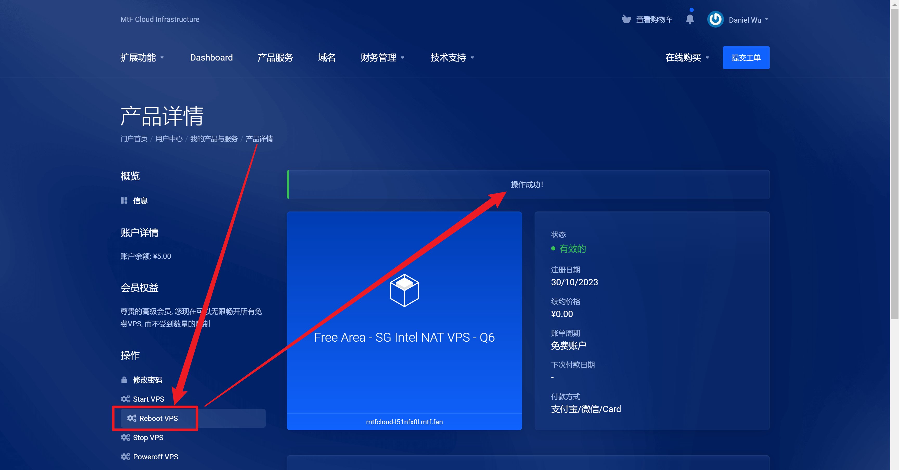

* 方案2: 点击产品详情页面左侧`Enduser Panel`，在`List VPS`页面选择你要操作的VPS，进入后台管理，点击右侧重启按钮，页面弹框`Success`，即表示重启成功

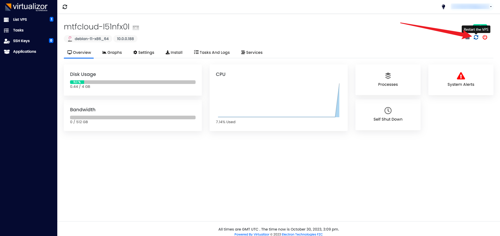
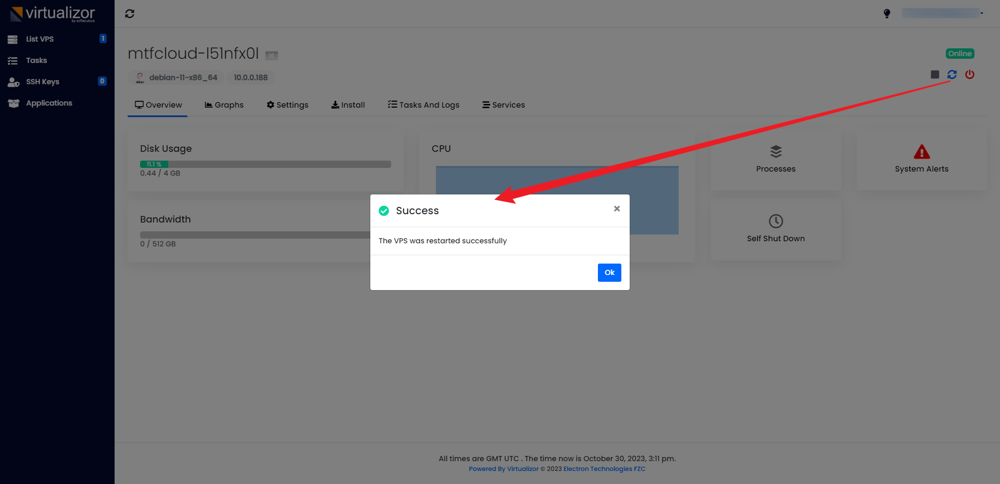

* 方案3: 在产品详情的`服务器信息`下的`VPS Information`里操作，点击重启按钮，页面弹框`Success`，即表示重启成功
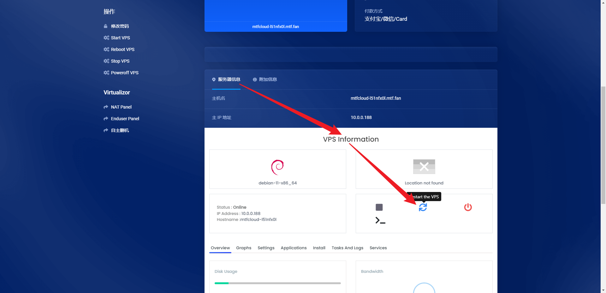
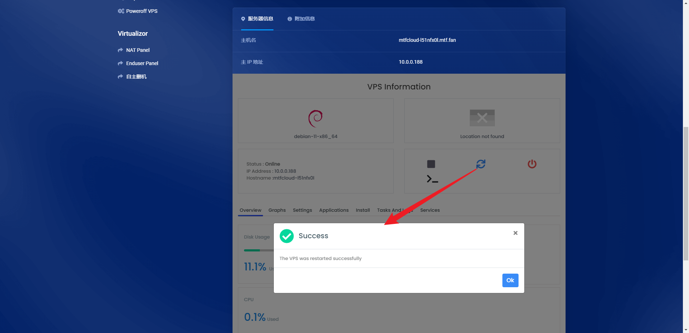

### 重装系统

* 方案1: 点击产品详情页面左侧`Enduser Panel`，在`List VPS`页面选择你要操作的VPS，进入后台管理，选择`Install`，根据自己需求进行重装

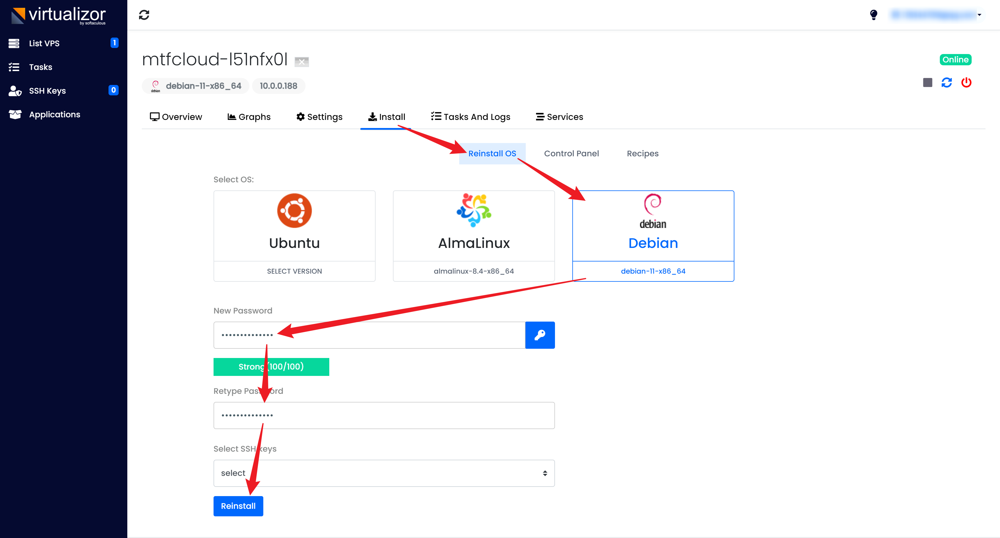

* 方案2: 在产品详情的`服务器信息`下的`VPS Information`里操作，操作步骤参考方案1最后一张图

