## SSH连接

首次连接会出现接受主机密钥的弹框，如不懂选择【接受并保存】即可

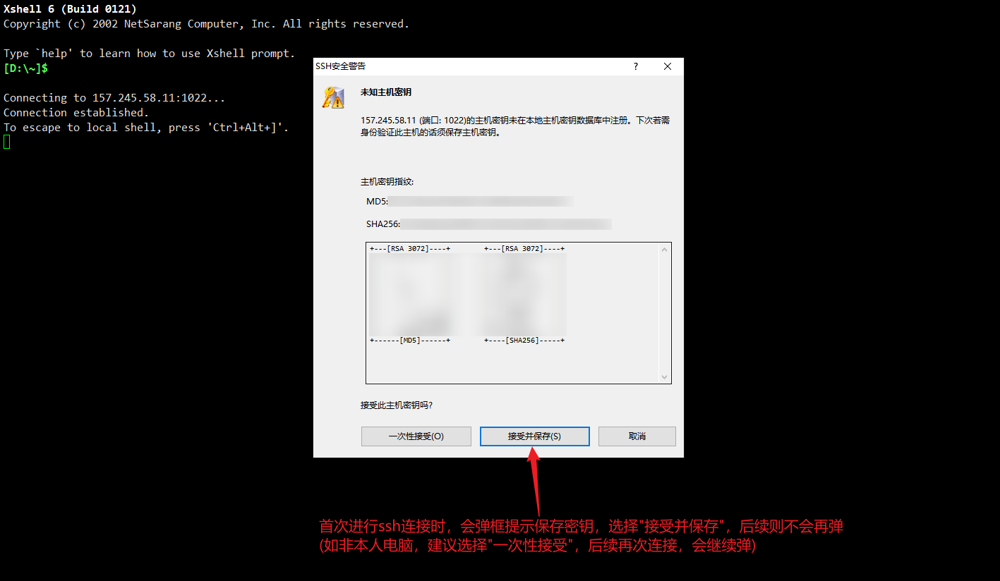


### 连接报错：`handshake failed` 或 `i/o timeout`

* Xshell
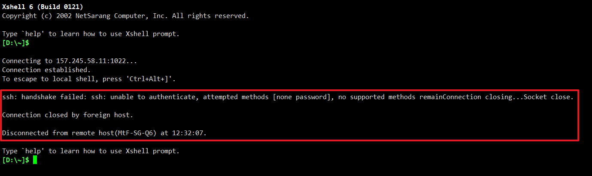

* FinalShell
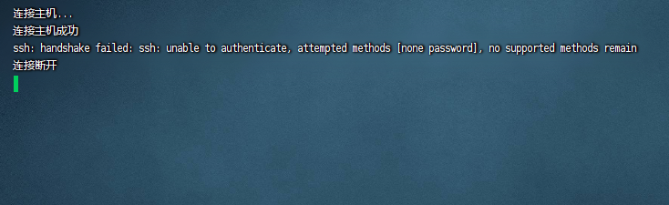
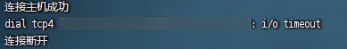

::: alert-info
解决方案:
* 方案一：[重启系统](basic.md#重启)
* 方案二：[重装系统](basic.md#重装系统)
:::

### 连接报错：`Connection failed` 或 `Connection timed out`

> 一般表示IP被墙，可以自行ping测试  

- Xshell  
 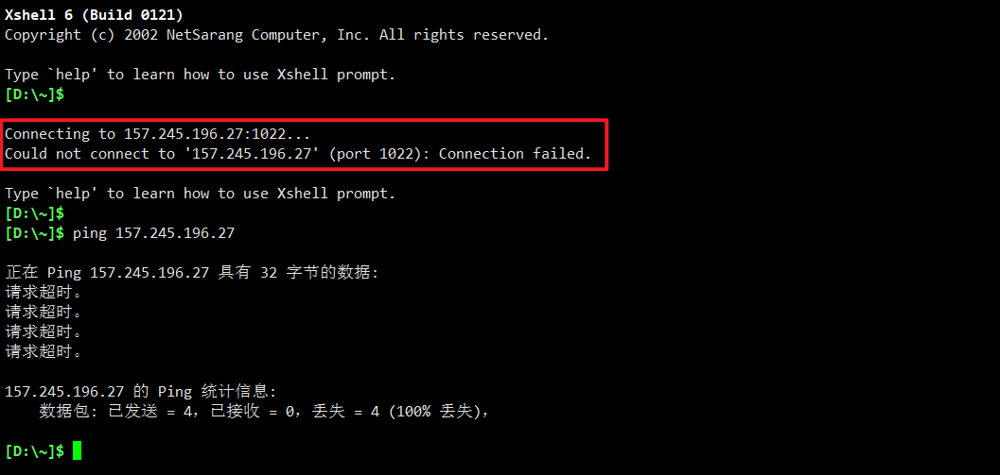

- FinalShell  
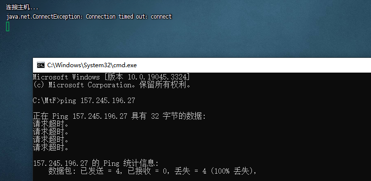

::: alert-info
解决方案:
* 方案一：通过网页版ssh工具连接
  * [开源 Sshwifty Web SSH Client](https://sshwifty-demo.nirui.org)
  * [群友@tb88vip提供](https://ssh.kjqg.gay)
  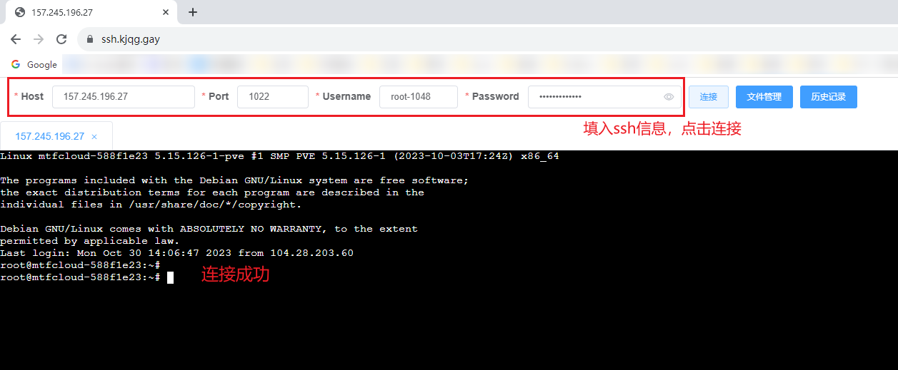

* 方案二：使用跳板机【未被墙的VPS】通过ssh命令连接
    *  命令格式 ```ssh -p 端口 用户名@IP``` 
    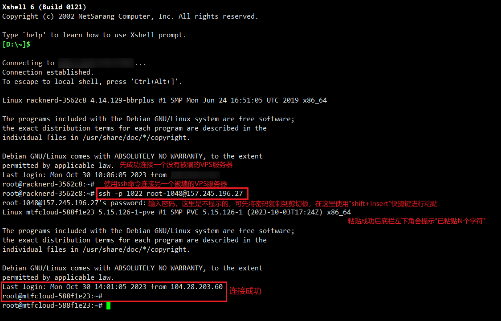
* 方案三: 设置ssh代理
    * Xshell
    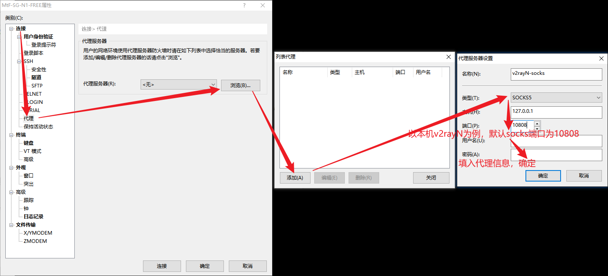
    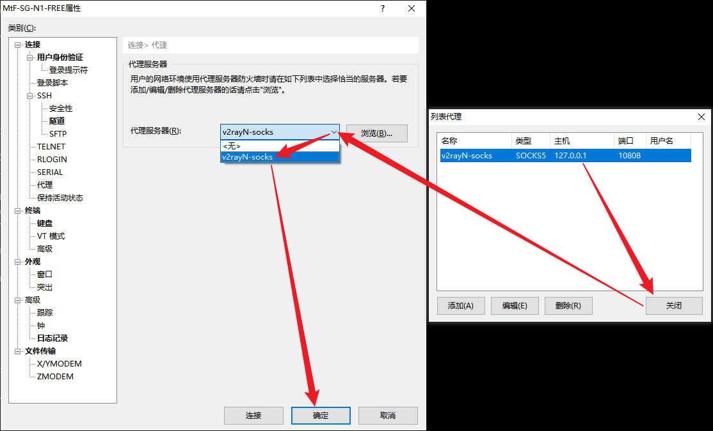
    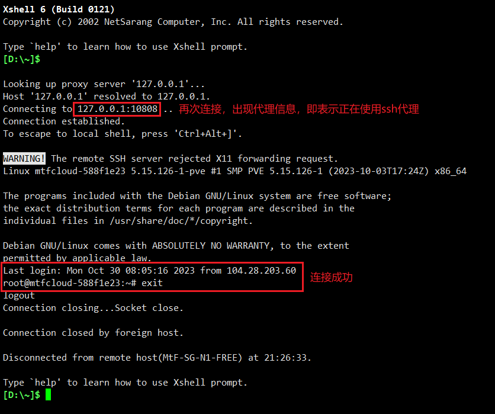

    * FinalShell 【两种方法选任意一种即可】
    方法1. 开启智能加速，可解决一般被墙IP
    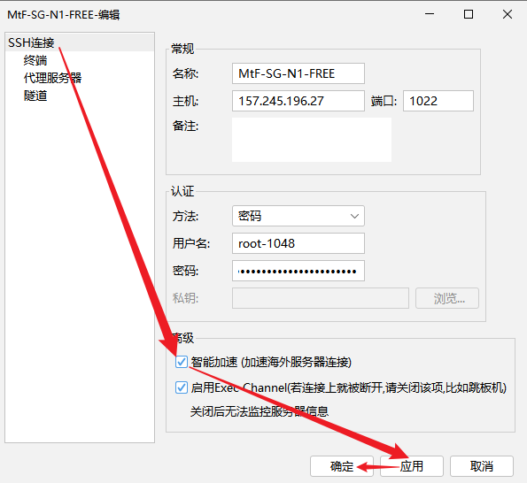
    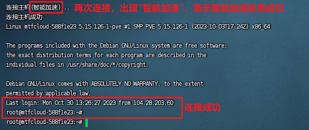
    方法2. 设置代理服务器，可解决大部分被墙IP
    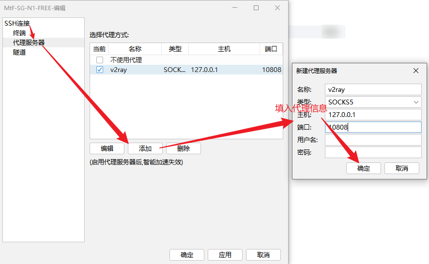
    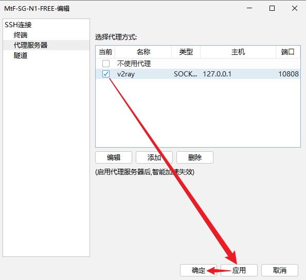
    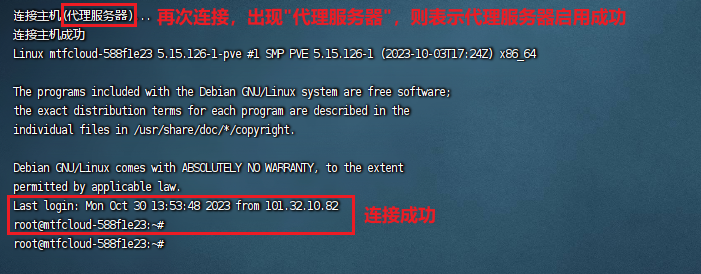
:::

### 其他错误补充

有群友反馈，`Xshell`需关闭`X11转移`功能。但我这边仅提示警告，并不影响连接，如果你在几种方案都尝试后，仍连接失败，可尝试关闭该功能。

 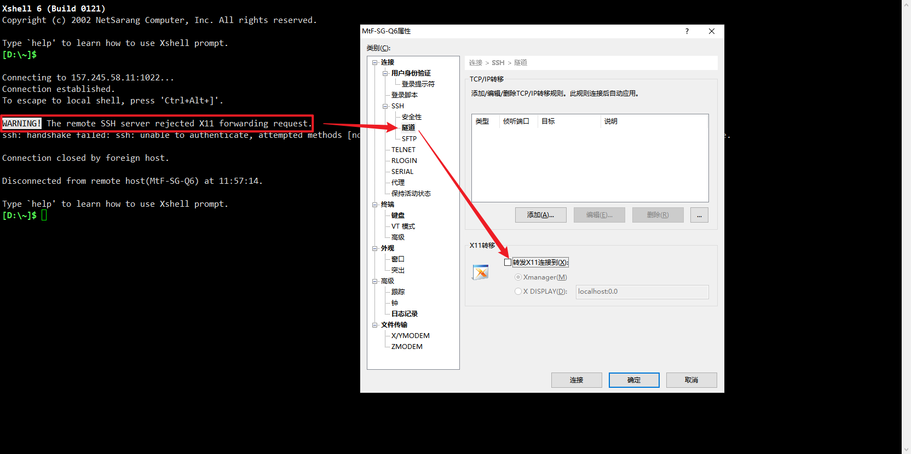

